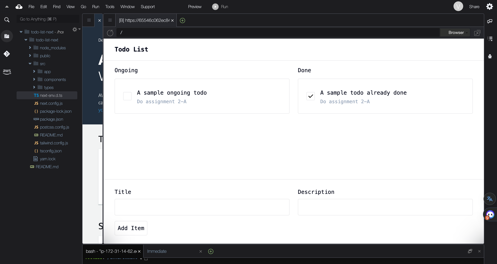
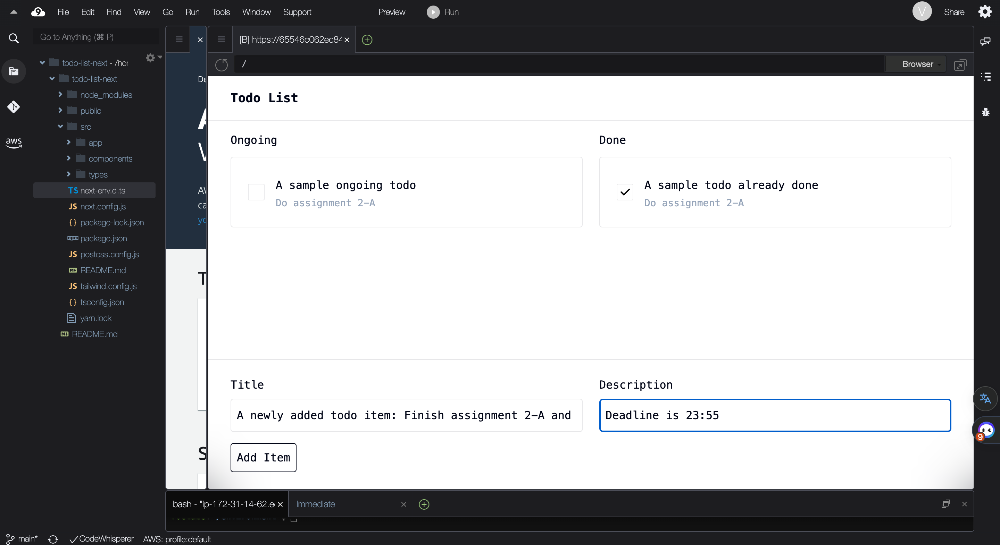
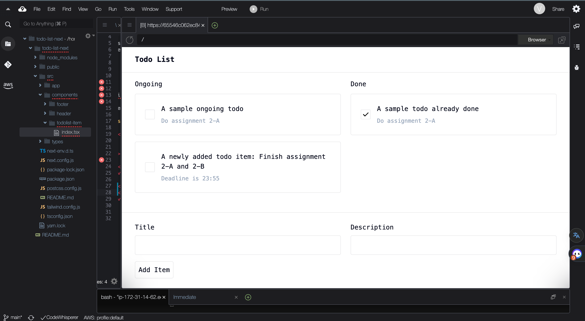
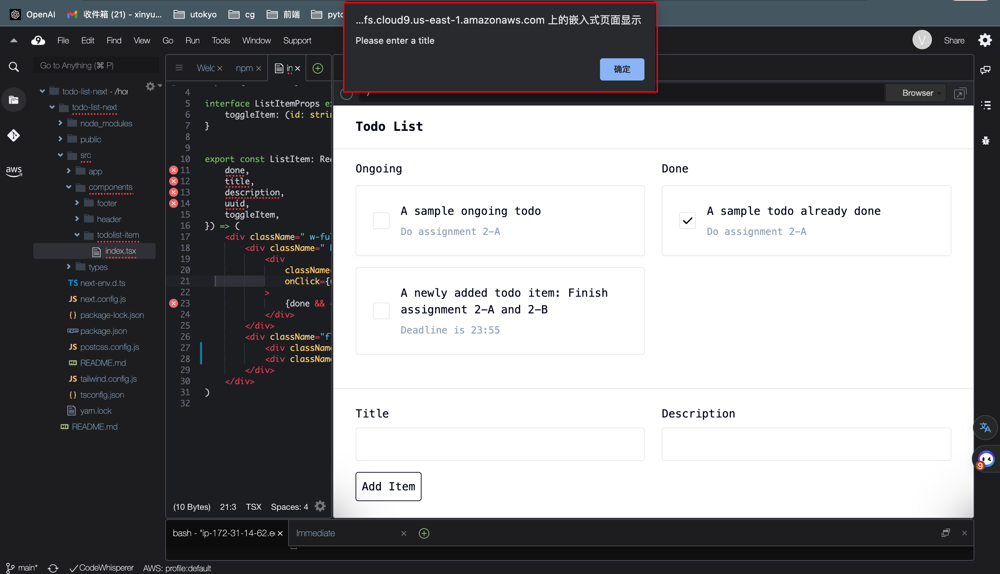
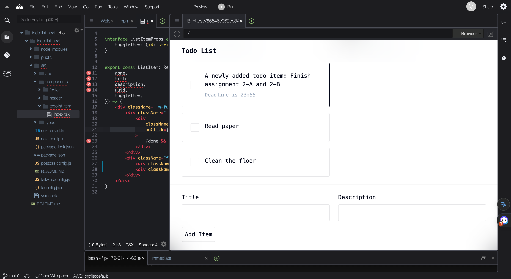
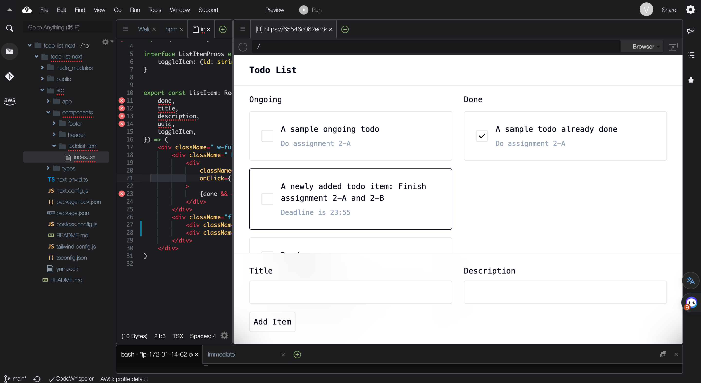
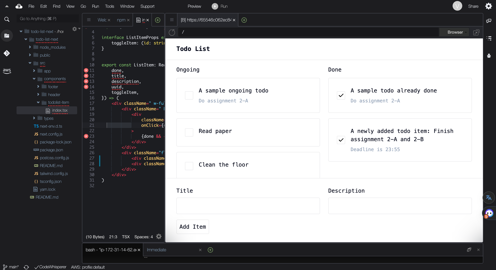

# Report

## Home page overview

The left column is ongoing todo items, while the right column is todo items that already done.

Users can add new items at footer area.

## Features

### Add a new todo item

Input title (required) and description (optional) for a new item, and then click "Add Item" button.

Successfully added.

If the user enters an empty title and clicks "Add Item", the page will alert a message "Please enter a title".

### See all todo items

Users can scroll down to see all todo items.

### Check a todo item

Users can check the checkbox to change the status of a todo item.
